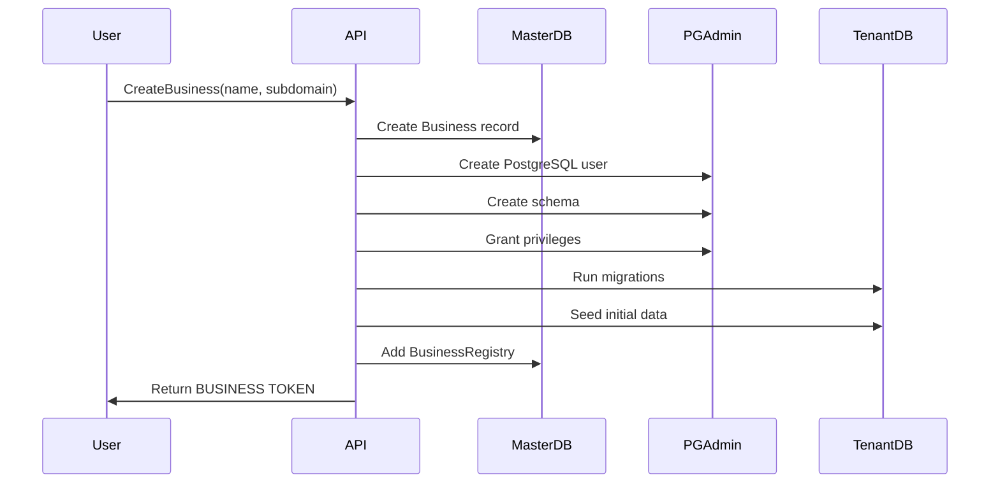

# Multi-Tenant Architecture Plan

## Overview
Complete multi-tenant system with PostgreSQL schema isolation, dedicated database users per tenant, and smart authentication flow that handles multi-business contexts.

## Core Architecture Principles

### 1. Complete Data Isolation
- Each business gets its own PostgreSQL schema (e.g., `business_acme`, `business_xyz`)
- Each business gets its own PostgreSQL user with access ONLY to their schema
- No possibility of data leakage between tenants
- Complete isolation of users, emails, settings, and all business data

### 2. Schema Structure
```
PostgreSQL Database
├── public (master schema)
│   ├── businesses          # Business registry
│   ├── business_registry   # User-business mappings
│   └── users              # Principal user accounts
├── business_acme
│   ├── users              # Tenant-specific users
│   ├── user_roles         # Roles within this business
│   ├── email_templates    # Business email templates
│   └── [all business data]
└── business_xyz
    └── [isolated business data]
```

## Authentication Architecture

### Two-Type JWT Token System

#### PRINCIPAL TOKEN (User-level)
- **Purpose**: Master account operations
- **Claims**: userId, email, roles: ["User"]
- **Scope**: Can only access master schema
- **Actions**: Create business, list own businesses, switch context

#### BUSINESS TOKEN (Business-context)
- **Purpose**: Business-specific operations
- **Claims**: userId, email, businessId, businessSchema, tenantRoles: ["Owner"]
- **Scope**: Can access specific business schema only
- **Actions**: All operations within that business context

### Smart SignIn Flow

```graphql
mutation SignIn {
  signIn(input: {
    email: "user@example.com"
    password: "password"
    businessId: "acme"  # Optional - for direct business signin
  })
}
```

**Resolution Logic:**
1. If `businessId` provided → Validate access → Return BUSINESS TOKEN
2. If user has exactly ONE business → Auto-return BUSINESS TOKEN
3. If user has MULTIPLE businesses → Return PRINCIPAL TOKEN + business list
4. If user has NO businesses → Return PRINCIPAL TOKEN only

### Token Exchange

```graphql
mutation SwitchBusinessContext {
  switchBusinessContext(businessId: "acme") {
    token       # New BUSINESS TOKEN
    tokenType   # "BUSINESS"
    business {
      id
      name
      schema
    }
    role        # User's role in this business
  }
}
```

## Database Design

### Master Schema (public)

#### Business Entity
```csharp
public class Business
{
    public string Id { get; set; }           // e.g., "acme"
    public string Name { get; set; }         // e.g., "Acme Corporation"
    public string Subdomain { get; set; }    // e.g., "acme" for acme.app.com
    public string SchemaName { get; set; }   // e.g., "business_acme"
    public string DatabaseUser { get; set; } // e.g., "user_acme"
    public string EncryptedPassword { get; set; } // Encrypted DB password
    public BusinessStatus Status { get; set; }
    public DateTime CreatedAt { get; set; }
    public DateTime? LastActiveAt { get; set; }
}
```

#### BusinessRegistry Entity
```csharp
public class BusinessRegistry
{
    public int Id { get; set; }
    public string BusinessId { get; set; }
    public string UserId { get; set; }       // Principal user ID
    public string TenantUserId { get; set; } // User ID in tenant schema
    public string Role { get; set; }         // Owner, Admin, Member
    public DateTime JoinedAt { get; set; }
    
    // Navigation
    public Business Business { get; set; }
    public User User { get; set; }
}
```

### Tenant Schema (business_*)

Each business schema contains complete isolated tables:
- `users` - Business-specific user accounts
- `user_roles` - Roles within the business
- `email_templates` - Business email templates
- `email_outbox` - Email queue
- `user_mail_settings` - User preferences
- [All other business-specific tables]

## Implementation Components

### 1. PostgreSQL Management Service
```csharp
public interface IPostgreSQLManagementService
{
    Task<(string username, string password)> CreateDatabaseUserAsync(string businessId);
    Task CreateSchemaAsync(string schemaName, string owner);
    Task GrantSchemaAccessAsync(string schemaName, string username);
    Task RevokeAllAccessAsync(string username, string[] excludeSchemas);
    Task DropSchemaAsync(string schemaName);
    Task DropUserAsync(string username);
}
```

### 2. Tenant Connection Service
```csharp
public interface ITenantConnectionService
{
    string BuildConnectionString(string businessId);
    DbContextOptions<TenantDbContext> GetTenantOptions(string businessId);
    Task<bool> ValidateConnectionAsync(string businessId);
    void ClearCache(string businessId);
}
```

### 3. Migration Service
```csharp
public interface ITenantMigrationService
{
    Task<bool> ApplyMigrationsAsync(string businessId);
    Task<string[]> GetPendingMigrationsAsync(string businessId);
    Task<bool> RollbackMigrationAsync(string businessId, string migration);
    Task<MigrationStatus> GetStatusAsync(string businessId);
}
```

### 4. Seeder Service
```csharp
public interface ITenantSeederService
{
    Task SeedBusinessAsync(string businessId, SeedOptions options);
    Task SeedUsersAsync(string businessId, UserSeedData[] users);
    Task SeedEmailTemplatesAsync(string businessId, string templateSet);
    Task SeedReferenceDataAsync(string businessId);
}

public class SeedOptions
{
    public string AdminEmail { get; set; }
    public string AdminName { get; set; }
    public string BusinessName { get; set; }
    public string TemplateSet { get; set; } = "default";
    public bool SeedSampleData { get; set; } = false;
}
```

### 5. Business Service
```csharp
public interface IBusinessService
{
    Task<BusinessCreationResult> CreateBusinessAsync(CreateBusinessInput input);
    Task<Business> GetBusinessAsync(string businessId);
    Task<Business[]> GetUserBusinessesAsync(string userId);
    Task<bool> AddUserToBusinessAsync(string businessId, string email, string role);
    Task<bool> RemoveUserFromBusinessAsync(string businessId, string userId);
    Task<bool> DeactivateBusinessAsync(string businessId);
}
```

## Business Creation Flow



## CLI Commands

### Business Management
```bash
# Create new business with full isolation
dotnet run -- business:create --name="Acme Corp" --subdomain=acme --owner=admin@acme.com

# List all businesses
dotnet run -- business:list

# Get business details
dotnet run -- business:info --id=acme

# Deactivate business (soft delete)
dotnet run -- business:deactivate --id=acme

# Drop business (DANGER - permanent)
dotnet run -- business:drop --id=acme --confirm=yes
```

### Migration Management
```bash
# Run migrations on specific tenant
dotnet run -- migrate:tenant --business=acme

# Run migrations on all tenants
dotnet run -- migrate:all-tenants

# Check migration status
dotnet run -- migrate:status --business=acme

# Rollback last migration
dotnet run -- migrate:rollback --business=acme
```

### Seeding Commands
```bash
# Seed tenant with default data
dotnet run -- seed:tenant --business=acme --template=default

# Seed specific data
dotnet run -- seed:tenant --business=acme --users=5 --sample-data

# Reset and reseed
dotnet run -- seed:reset --business=acme --confirm=yes
```

## Security Considerations

### Database Level
1. Each tenant user can ONLY access their assigned schema
2. Connection strings are encrypted in master database
3. Database passwords are auto-generated and strong
4. No cross-schema queries possible

### Application Level
1. Token validation ensures business context
2. Middleware validates every request's business access
3. Audit logging for all cross-tenant attempts
4. Rate limiting per business

### Network Level
1. Subdomain isolation (acme.app.com)
2. Optional: Separate database servers per tier
3. SSL/TLS for all connections
4. VPN for database access

## Migration Path for Existing System

### Phase 1: Setup Infrastructure
1. Create master tables (businesses, business_registry)
2. Implement PostgreSQL management service
3. Create tenant connection service
4. Setup migration service

### Phase 2: Authentication Enhancement
1. Modify JWT generation for dual token types
2. Update SignIn mutation for business context
3. Add SwitchBusinessContext mutation
4. Implement BusinessContext middleware

### Phase 3: Business Operations
1. Create business creation mutation
2. Implement schema bootstrapping
3. Add seeding system
4. Create management CLI

### Phase 4: Testing & Validation
1. Test complete isolation
2. Verify no data leakage
3. Performance testing
4. Security audit

## Benefits

1. **Complete Isolation** - True multi-tenancy at database level
2. **Security** - PostgreSQL enforced access control
3. **Scalability** - Can move schemas to different servers
4. **Compliance** - Data residency and isolation for regulations
5. **Performance** - No row-level filtering overhead
6. **Backup/Restore** - Per-business operations
7. **Customization** - Each business can have custom schema

## Future Enhancements

1. **Schema Versioning** - Different businesses on different versions
2. **Blue-Green Deployments** - Per-tenant rollouts
3. **Data Export** - Complete business data export
4. **White-Labeling** - Custom domains per business
5. **Sharding** - Distribute businesses across servers
6. **Read Replicas** - Per-business read scaling