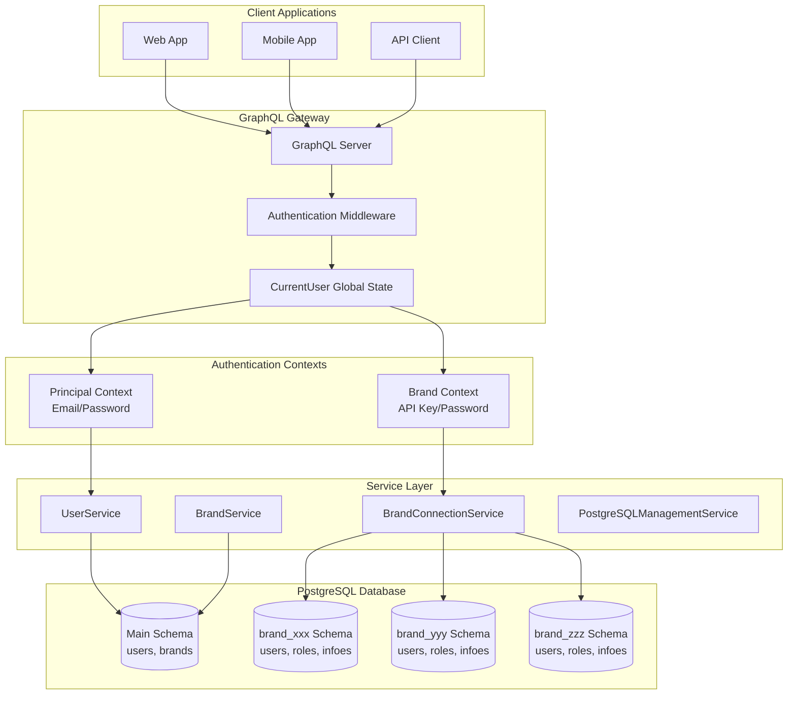

# Brand Architecture Documentation

## Executive Summary

The Kanriya system implements a sophisticated multi-tenant architecture where each brand (tenant) operates in complete isolation using PostgreSQL schema separation. The system supports dual authentication contexts: Principal (system-level) and Brand (tenant-level), with 90% of operations occurring within brand context.

## Architecture Overview



## Core Components

### 1. Authentication Layer

#### AuthenticationMiddleware
Located: `/Program/AuthenticationMiddleware.cs`

Responsibilities:
- Extract JWT token from Authorization header
- Validate token signature and claims
- Determine authentication context (Principal vs Brand)
- Populate CurrentUser object

Key Logic:
```csharp
// Detect token type
var tokenTypeClaim = principal.FindFirst("token_type");
if (tokenTypeClaim?.Value == "BRAND")
{
    // Brand context - API authentication
    currentUser.BrandUser = CreateBrandUser(principal);
    currentUser.BrandId = principal.FindFirst("brand_id")?.Value;
    currentUser.BrandSchema = principal.FindFirst("brand_schema")?.Value;
}
else
{
    // Principal context - Email/password authentication
    currentUser.User = await userService.GetByIdAsync(userId);
}
```

#### CurrentUserGlobalState
Located: `/Program/CurrentUserGlobalState.cs`

Responsibilities:
- Inject CurrentUser into GraphQL global state
- Make authentication context available to all resolvers
- Provide unified access pattern across the application

### 2. Service Layer

#### BrandService
Located: `/Services/Data/BrandService.cs`

Key Operations:
- `CreateBrandAsync()`: Creates brand with schema, tables, and initial data
- `DeleteBrandAsync()`: Removes brand and all associated resources
- `GetBrandInfoAsync()`: Retrieves key-value pairs from infoes table
- `UpdateBrandInfoAsync()`: Updates configuration in infoes table

Schema Creation Process:
1. Generate unique schema name: `brand_[guid]`
2. Create PostgreSQL schema
3. Create database user with schema permissions
4. Create tables:
   - `users`: Brand-specific users
   - `user_roles`: Role assignments
   - `infoes`: Configuration store
5. Insert initial data:
   - Brand owner user with API credentials
   - BrandOwner role assignment
   - "Brand Name" in infoes

#### BrandConnectionService
Located: `/Services/Data/BrandConnectionService.cs`

Responsibilities:
- Manage per-brand database connections
- Cache connections for performance
- Ensure connection string security
- Handle connection lifecycle

Connection Pattern:
```csharp
public async Task<NpgsqlConnection> GetBrandConnectionAsync(string brandId)
{
    // Check cache first
    if (_connectionCache.TryGetValue(brandId, out var cached))
        return cached;
    
    // Create new connection with brand-specific credentials
    var brand = await GetBrandAsync(brandId);
    var connectionString = BuildBrandConnectionString(brand);
    var connection = new NpgsqlConnection(connectionString);
    
    // Cache and return
    _connectionCache[brandId] = connection;
    return connection;
}
```

### 3. GraphQL Layer

#### Brand Module Structure
Located: `/Modules/BrandModule.cs`

Contains two classes:
- `BrandQueries`: Query operations
- `BrandMutations`: Mutation operations

Key Operations:

**Queries** (Principal Context):
- `myBrands`: Get all brands owned by current user
- `brand(brandId)`: Get specific brand details

**Queries** (Brand Context):
- `brandInfo`: Get all key-value pairs from infoes table

**Mutations** (Principal Context):
- `createBrand`: Create new brand with API credentials
- `deleteBrand`: Permanently delete brand

**Mutations** (Brand Context):
- `updateBrandInfo`: Update key-value in infoes table

### 4. Database Layer

#### Schema Structure

**Main Schema** (public):
```sql
-- Principal users table
CREATE TABLE users (
    id UUID PRIMARY KEY,
    email VARCHAR(255) UNIQUE,
    password_hash TEXT,
    name VARCHAR(255),
    created_at TIMESTAMPTZ
);

-- Brands registry table
CREATE TABLE brands (
    id UUID PRIMARY KEY,
    name VARCHAR(255) UNIQUE,  -- Immutable
    schema_name VARCHAR(100),
    owner_id UUID REFERENCES users(id) ON DELETE CASCADE,
    is_active BOOLEAN,
    created_at TIMESTAMPTZ
);
```

**Brand Schema** (brand_xxx):
```sql
-- Brand-specific users
CREATE TABLE users (
    id UUID PRIMARY KEY,
    api_secret VARCHAR(16) UNIQUE,
    api_password_hash TEXT,
    display_name VARCHAR(255),
    is_active BOOLEAN,
    created_at TIMESTAMPTZ
);

-- Role assignments
CREATE TABLE user_roles (
    user_id UUID REFERENCES users(id) ON DELETE CASCADE,
    role VARCHAR(50),
    created_at TIMESTAMPTZ
);

-- Configuration store
CREATE TABLE infoes (
    id UUID PRIMARY KEY,
    key VARCHAR(100) UNIQUE,
    value TEXT,
    created_at TIMESTAMPTZ,
    updated_at TIMESTAMPTZ
);
```

## Security Model

### Authentication Flow

1. **Principal Authentication**:
   ```
   Email + Password → JWT Token → Principal Context → System Operations
   ```

2. **Brand Authentication**:
   ```
   API Key + Password + Brand ID → JWT Token → Brand Context → Brand Operations
   ```

### Authorization Rules

| Operation | Principal Context | Brand Context |
|-----------|------------------|---------------|
| Create Brand | ✅ Allowed | ❌ Denied |
| Delete Brand | ✅ Owner only | ❌ Denied |
| List Brands | ✅ Own brands | ❌ Denied |
| Get Brand Info | ❌ Denied | ✅ Own brand only |
| Update Brand Info | ❌ Denied | ✅ Own brand only |
| Brand User Mgmt | ❌ Denied | ✅ Own brand only |

### Security Features

1. **Schema Isolation**: Complete data isolation between brands
2. **Immutable Registry**: Brand names cannot be changed after creation
3. **API Credential Security**: 
   - 16-character API key (cryptographically random)
   - 32-character API password (cryptographically random)
   - Passwords hashed with BCrypt
   - Credentials shown only once at creation
4. **Token Scoping**: Brand tokens can only access their assigned brand
5. **Cross-Brand Prevention**: Systematic checks prevent data leakage

## API Usage Examples

### Creating a Brand (Principal Context)

```graphql
mutation CreateBrand {
  createBrand(input: { name: "Geprek Bensu" }) {
    success
    message
    brand {
      id
      name
      schemaName
    }
    apiSecret    # Save this!
    apiPassword  # Save this!
  }
}
```

### Brand Authentication

```graphql
mutation BrandSignIn {
  signIn(input: {
    email: "API_SECRET_HERE"
    password: "API_PASSWORD_HERE"
    brandId: "BRAND_ID_HERE"
  }) {
    success
    token  # Brand-context JWT
  }
}
```

### Managing Brand Info (Brand Context)

```graphql
# Get all configuration
query GetBrandInfo {
  brandInfo {
    key
    value
    updatedAt
  }
}

# Update configuration
mutation UpdateBrandInfo {
  updateBrandInfo(input: {
    key: "Brand Name"
    value: "Geprek Bensu - Jakarta"
  }) {
    success
    message
  }
}
```

## Performance Considerations

### Connection Pooling
- Connections cached per brand
- Lazy loading on first access
- Automatic cleanup on brand deletion

### Query Optimization
- Indexes on frequently queried columns
- Efficient schema queries using information_schema
- Batch operations where possible

### Caching Strategy
- Brand metadata cached in memory
- Connection strings cached securely
- GraphQL query results cached per request

## Monitoring and Logging

### Key Metrics
- Brand creation/deletion rate
- API authentication success/failure
- Schema operation performance
- Connection pool utilization

### Audit Trail
- All brand operations logged
- Authentication attempts tracked
- Schema modifications recorded
- API usage per brand monitored

## Migration Path

### Adding New Brand Features
1. Update brand schema migrations
2. Implement in BrandService
3. Add GraphQL operations
4. Update tests
5. Deploy with zero downtime

### Schema Updates
1. Create migration script
2. Test on staging environment
3. Apply to each brand schema
4. Verify data integrity
5. Update documentation

## Best Practices

### Development Guidelines
1. **Always check authentication context** before operations
2. **Never mix contexts** - keep principal and brand operations separate
3. **Validate brand ownership** for all brand-specific operations
4. **Use transactions** for multi-table operations
5. **Log all critical operations** for audit trail

### Testing Strategy
1. Test both authentication contexts
2. Verify cross-brand isolation
3. Test cascade deletions
4. Validate token claims
5. Check error handling

### Deployment Considerations
1. Database migrations must be backward compatible
2. Schema changes require maintenance window
3. API credentials cannot be recovered if lost
4. Monitor schema count for database limits
5. Regular backup of brand schemas

## Future Enhancements

### Planned Features
1. **Brand Templates**: Pre-configured brand setups
2. **Brand Switching**: Allow users to switch between accessible brands
3. **Webhook System**: Brand-specific event webhooks
4. **API Rate Limiting**: Per-brand rate limits
5. **Brand Analytics**: Usage metrics and insights
6. **Backup/Restore**: Per-brand backup capabilities

### Scalability Roadmap
1. **Horizontal Scaling**: Multiple database servers
2. **Read Replicas**: Per-brand read replicas
3. **Caching Layer**: Redis for frequently accessed data
4. **CDN Integration**: Static asset delivery
5. **Microservices**: Extract brand services

## Conclusion

The dual-context authentication system with schema isolation provides enterprise-grade multi-tenancy with complete data isolation, secure API access, and flexible configuration management. The architecture scales horizontally and maintains security through multiple layers of protection.