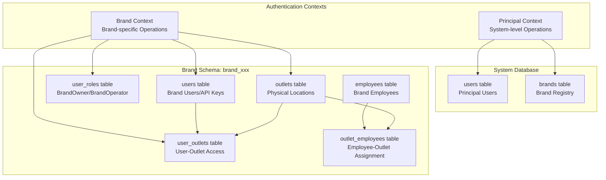
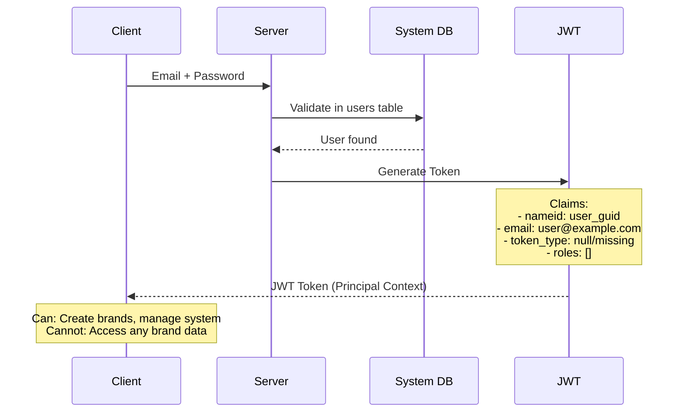
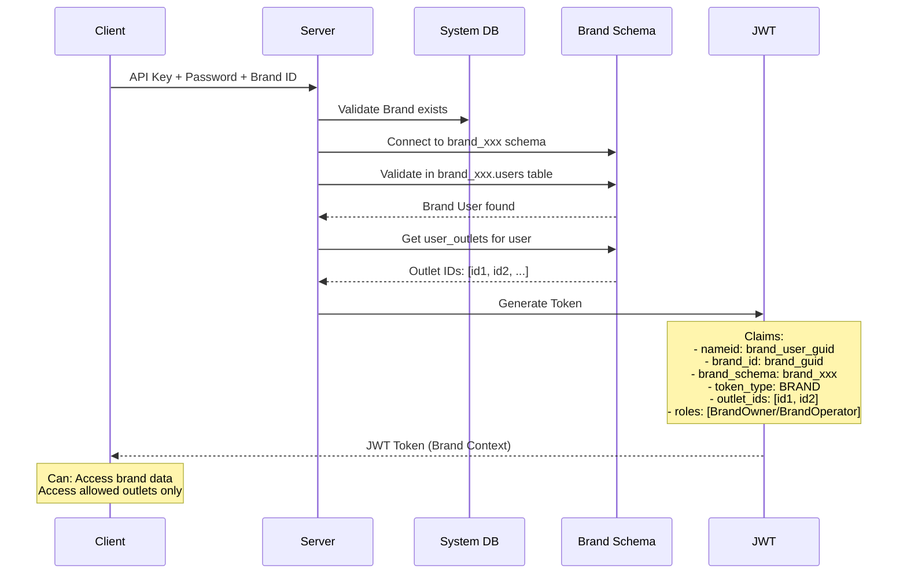
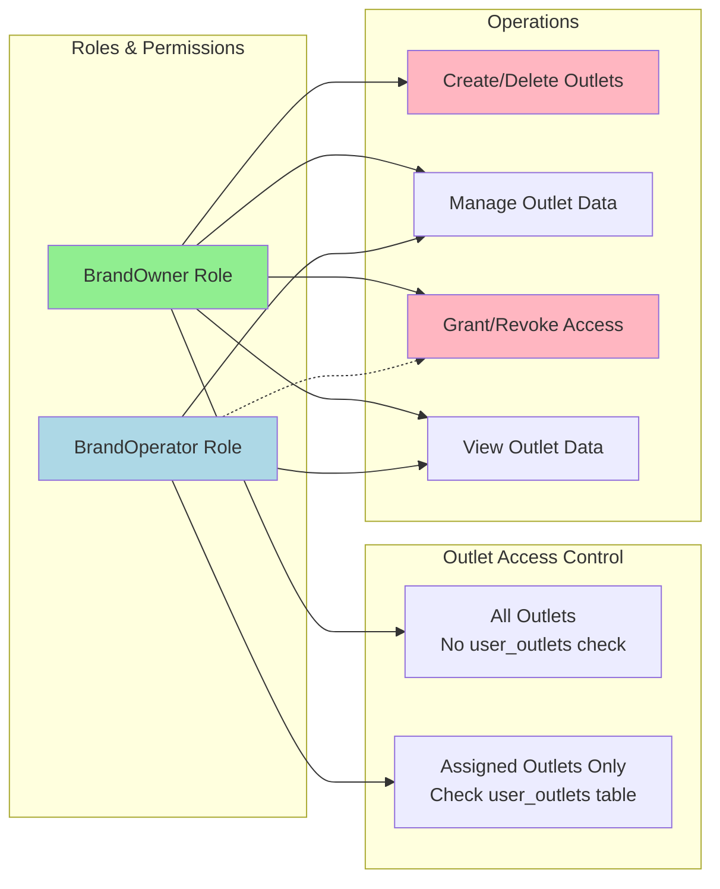
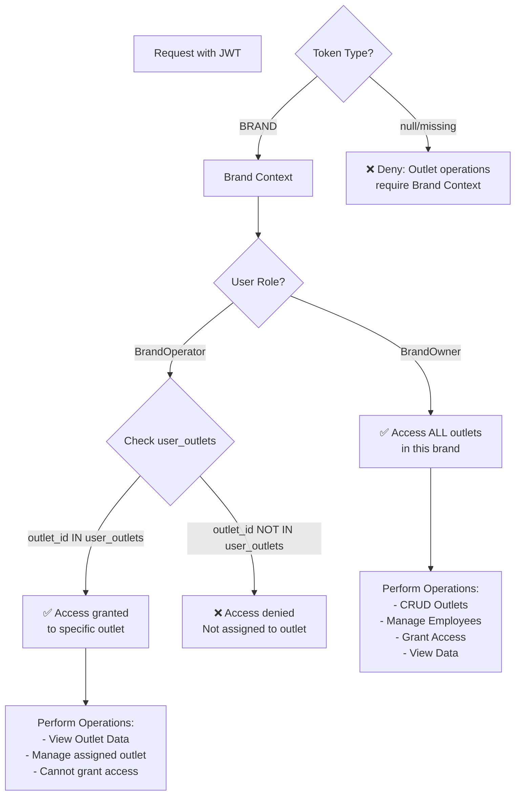
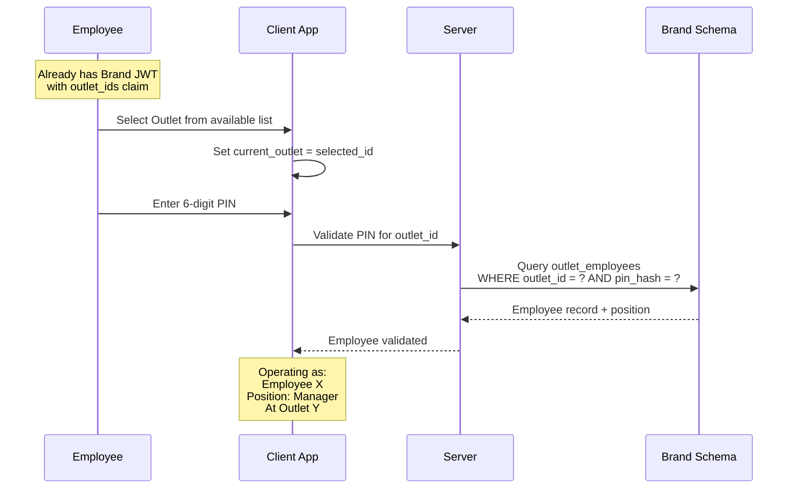

# Authentication & Authorization Flow for Outlets

## Authentication Contexts Overview

## Authentication Flow

### 1. Principal Authentication (System Admin)

### 2. Brand Authentication (Brand Operations)

## Authorization Matrix

### Role-Based Outlet Access

## Outlet Access Validation Flow

## Employee Authentication (Future - Phase 3/4)

## Key Security Points

1. **Principal Context**: 
   - Cannot access ANY brand-specific data
   - Only for system administration
   - No outlet access whatsoever

2. **Brand Context Required**:
   - ALL outlet operations require Brand authentication
   - Must have valid brand_id and brand_schema in JWT
   - token_type must be "BRAND"

3. **Outlet Access Control**:
   - BrandOwner: Bypasses user_outlets check, full access
   - BrandOperator: Must be in user_outlets table for access
   - No cross-brand outlet access possible

4. **Data Isolation**:
   - Each brand's outlets completely isolated in brand_xxx schema
   - No shared outlet data between brands
   - outlet_id only meaningful within brand context

## Common Mistakes to Avoid

❌ **Wrong**: Allowing Principal users to access outlets
✅ **Right**: Outlets only accessible in Brand context

❌ **Wrong**: Checking outlet permissions for BrandOwner
✅ **Right**: BrandOwner has implicit access to all brand outlets

❌ **Wrong**: Using "Business" or "Tenant" terminology
✅ **Right**: Always use "Brand" terminology

❌ **Wrong**: Sharing outlet IDs across brands
✅ **Right**: Outlet IDs are brand-scoped (UUID but unique per schema)